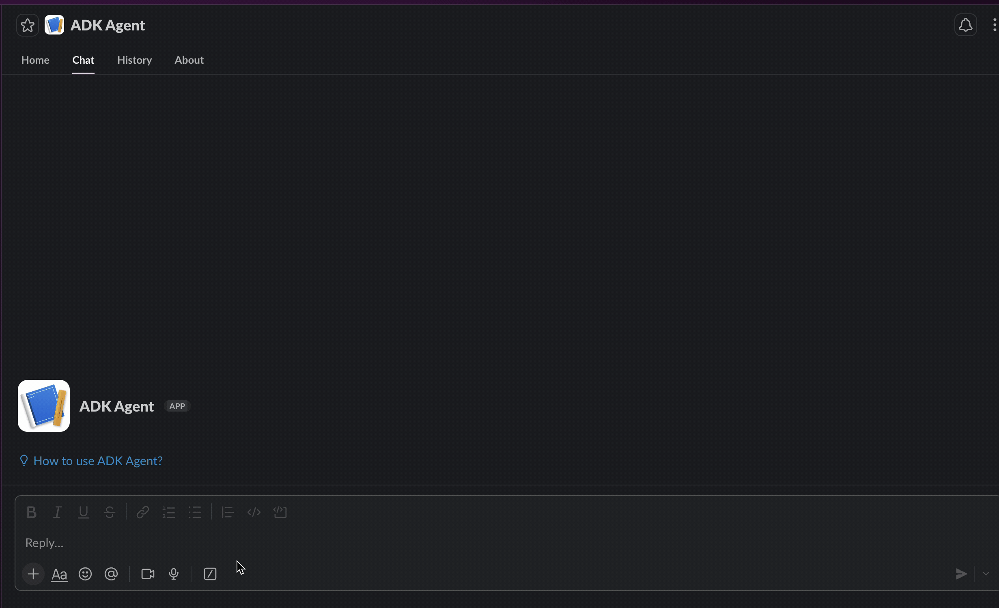
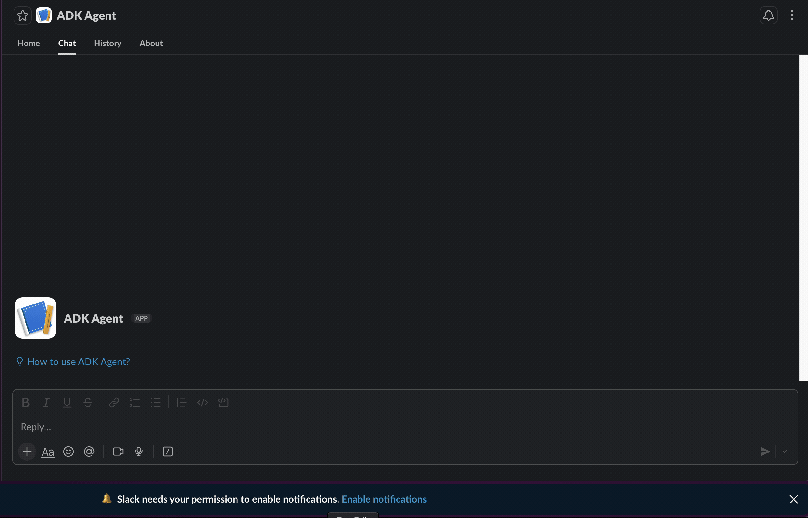

# Slack ADK Agent
##### Google Search

---
##### Vertex AI Search Tool

This project implements a Slack Agent using the **Google Agent Development Kit (ADK)** and **Slack Bolt**. The agent can interact with users in Slack channels, answer questions, and perform Google Searches using a delegated search agent.

## Features

- **Slack Integration**: Built with `slack_bolt` to handle events like `app_mention` and `message`.
- **ADK Powered**: Uses Google ADK for agent logic, tool management, and multi-agent delegation.
- **Google Search**: Includes a specialized `search_agent` that can perform Google Searches to answer user queries.
- **Vertex AI Search**: Integrates with Vertex AI Search to answer questions using your internal data stores.
- **Socket Mode**: Supports Slack Socket Mode for easy local development without public endpoints.

## Prerequisites

- Python 3.10+
- A Slack App with Socket Mode enabled.
- Google Cloud Project with Vertex AI API enabled.
- **Vertex AI Search Data Store**: A data store created in Vertex AI Search & Conversation.

## Setup

1.  **Clone the repository**:
    ```bash
    git clone <repository-url>
    cd slack-adk
    ```

2.  **Install dependencies**:
    ```bash
    pip install -r requirements.txt
    ```
    *(Note: Ensure `google-adk` and `slack_bolt` are installed)*

3.  **Configure Environment**:
    Create a `.env` file in `slack_agent/.env` with the following credentials:

    ```env
    SLACK_APP_ID=<your-app-id>
    SLACK_CLIENT_ID=<your-client-id>
    SLACK_CLIENT_SECRET=<your-client-secret>
    SLACK_SIGNING_SECRET=<your-signing-secret>
    SLACK_BOT_TOKEN=xoxb-...
    SLACK_APP_TOKEN=xapp-...
    GOOGLE_CLOUD_PROJECT=<your-google-cloud-project-id>
    GOOGLE_CLOUD_LOCATION=us-central1
    GOOGLE_GENAI_USE_VERTEXAI=1
    VERTEX_AI_SEARCH_DATA_STORE_ID=<your-data-store-id>
    ```

4.  **Slack App Configuration**:
    - **Manifest**: Use the provided `manifest.yaml` to configure your Slack App settings (Scopes, Events, Socket Mode).
    - **Scopes**: Ensure `chat:write` and `app_mentions:read` are enabled.
    - **Install**: Install the app to your workspace.

## Running the Agent

Run the bot as a module from the root directory:

```bash
python -m slack_agent.bot
```

The bot will start in **Socket Mode** if `SLACK_APP_TOKEN` is present in `.env`.

## Usage

- **Mention the bot**: `@ADK Agent help me find info about X`
- **Direct Message**: DM the bot directly.

- **Direct Message**: DM the bot directly.

The agent will process your request:
1.  **Internal Knowledge**: It first checks your Vertex AI Search data store for answers.
2.  **External Search**: If no internal answer is found and external research is approved, it delegates to Google Search.


## Project Structure

- `slack_agent/bot.py`: Entry point. Initializes Slack Bolt app and ADK Runner. Handles Slack events.
- `slack_agent/agent.py`: Defines the ADK Agents (`root_agent`, `search_agent`) and tools.
- `slack_agent/spec.yaml`: OpenAPI spec for Slack API tools.
- `manifest.yaml`: Slack App Manifest for easy configuration.
